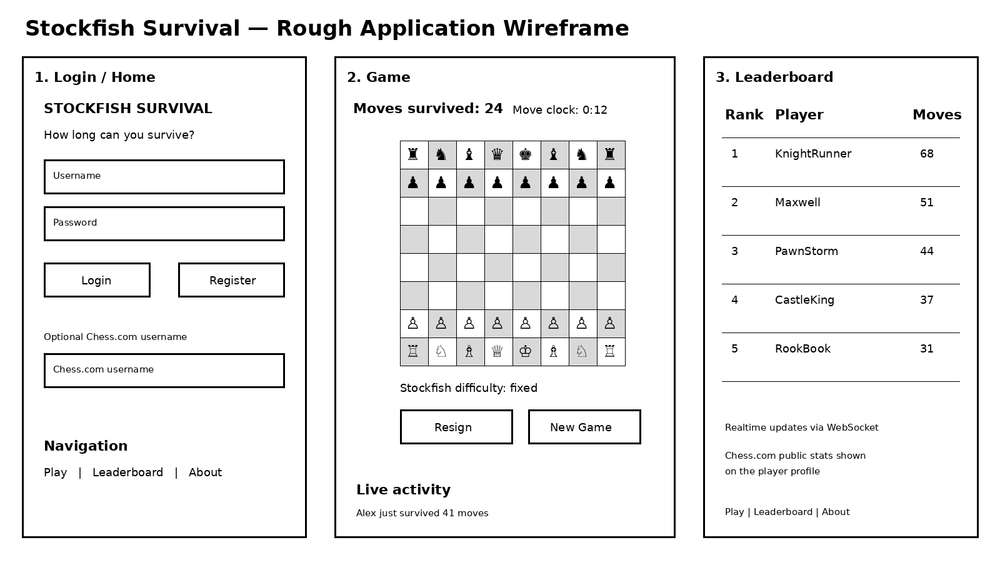
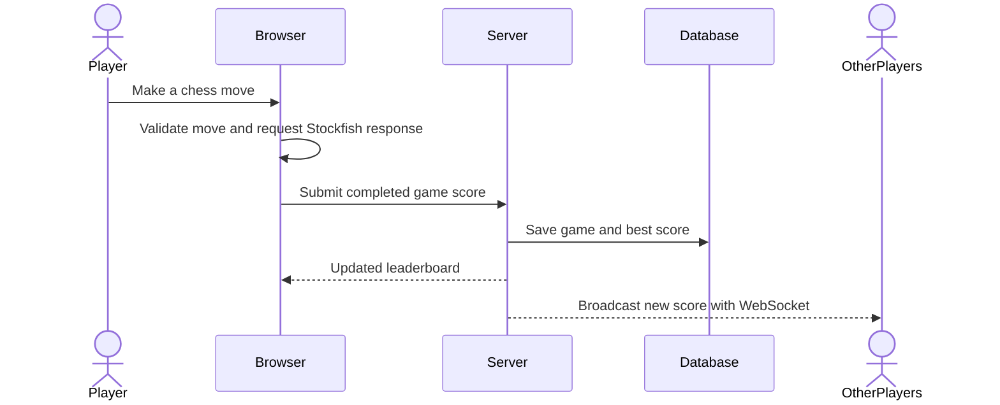

# Stockfish Survival

[My Notes](notes.md)

Stockfish Survival is a competitive chess game where the goal is not to beat Stockfish, but to survive against it for as many moves as possible. Every player faces the same engine difficulty and move time limit so scores are comparable. Completed games are saved and ranked on a global leaderboard.

## 🚀 Specification Deliverable

For this deliverable I did the following. I checked the box `[x]` and added a description for things I completed.

- [x] I completed the prerequisites for this deliverable (Git commit requirement)
- [x] **Proper use of Markdown** - The README uses headings, links, lists, an embedded image, a checklist, a fenced code block, and a Mermaid sequence diagram.
- [x] **A concise and compelling elevator pitch** - The elevator pitch explains the core idea and why competing to survive against Stockfish is interesting.
- [x] **Description of key features** - The key features section describes authentication, gameplay, scoring, saved results, the leaderboard, realtime updates, and third-party data.
- [x] **Description of how you will use each technology** - HTML, CSS, React, the backend service, MongoDB/login, WebSocket, and the Chess.com PubAPI are all explicitly described.
- [x] **One or more rough sketches of your application** - The rough wireframe is embedded below using a Markdown image reference.

### Elevator pitch

Most people are not going to beat Stockfish, but that does not mean playing it cannot be competitive. Stockfish Survival turns losing to one of the strongest chess engines in the world into the game itself. Players compete to survive as many moves as possible under the same conditions, save their best attempts, and watch the leaderboard update as other players finish games. It is simple to understand, difficult to master, and gives every game an obvious score to beat.

### Design



The application will have three main views: authentication/home, the chess game, and the leaderboard. The game view keeps the chessboard as the main focus and shows the current number of moves survived and the move clock. The leaderboard shows the best completed attempts.



### Key features

- Register, log in, and log out
- Play chess against a fixed Stockfish difficulty
- Use a fixed move clock so leaderboard attempts are comparable
- Track the number of moves survived before checkmate, resignation, or timeout
- Save completed games and personal best scores
- Display a global leaderboard ranked by moves survived
- Push new scores and game activity to connected users in realtime
- Optionally look up public Chess.com player statistics for a supplied Chess.com username

### Technologies

I am going to use the required technologies in the following ways.

- **HTML** - Provides the structure for the login, chess game, leaderboard, navigation, forms, buttons, status information, and application content.
- **CSS** - Styles the chessboard and application, creates a responsive layout for desktop and mobile screens, and provides clear visual feedback for selected squares, legal moves, game status, and leaderboard information.
- **React** - Provides components for authentication, the chessboard, game controls, player status, and leaderboard. React state will update the board, timer, game status, and navigation in response to user actions.
- **Service** - A Node.js/Express backend will provide endpoints for registration, login, logout, submitting completed games, retrieving personal game history, and retrieving leaderboard scores. The application will also call the [Chess.com PubAPI](https://support.chess.com/en/articles/9650547-what-is-the-pubapi-and-how-do-i-use-it) as the required third-party web service to retrieve public chess player statistics for an optional Chess.com username.
- **DB/Login** - MongoDB will store registered users, hashed authentication credentials, completed games, and best scores. Game submission and personal data endpoints will require authentication.
- **WebSocket** - When a player finishes a game or sets a new high score, the backend will broadcast that event to connected browsers so the leaderboard and live activity feed can update without refreshing the page.


## 🚀 AWS deliverable

For this deliverable I did the following.

- [x] **Server deployed and accessible with custom domain name** - <https://startup.beatstockfish.click>

**Startup URL for grading: <https://startup.beatstockfish.click>**

### EC2 server (10%)

- Launched an Ubuntu 24.04 `t3.micro` EC2 instance in `us-east-2` (AMI `ami-00adec9774170bad2`), instance ID `i-022afe63f35cd4af9`.
- Created an ed25519 SSH key pair `beatstockfish-key`. The private key lives locally at `~/.ssh/beatstockfish-key.pem` and is **not** committed.
- Created a security group that allows inbound TCP `22` (SSH), `80` (HTTP), and `443` (HTTPS), plus UDP `443` for HTTP/3, from anywhere.
- Allocated an Elastic IP (`3.151.188.205`) and associated it with the instance so the public address is stable across restarts.
- The instance runs a user-data boot script that installs Caddy from the official apt repository and enables it as a `systemd` service, so the web server comes up automatically.
- Verified reachable at `http://3.151.188.205` (now issues a `308` redirect to HTTPS, which is Caddy's default behavior once a domain is configured).

### Domain name (10%)

- Registered the domain **`beatstockfish.click`** through Porkbun.
- Created a **Route 53 public hosted zone** for `beatstockfish.click` (hosted zone ID `Z10157641EIX9JEG4AC8O`).
- Changed the authoritative nameservers at Porkbun to the four Route 53 nameservers, so all DNS for the domain is now served by Route 53:
  - `ns-660.awsdns-18.net`, `ns-261.awsdns-32.com`, `ns-1161.awsdns-17.org`, `ns-2037.awsdns-62.co.uk`
- Added A records in the Route 53 hosted zone, all pointing at the Elastic IP `3.151.188.205`:
  - `beatstockfish.click`
  - `startup.beatstockfish.click`
  - `*.beatstockfish.click` (wildcard, for future subdomains)
- Note: Route 53's *domain registration* service is blocked on the new AWS account experience unless you irreversibly "activate advanced features", so the domain itself was registered at Porkbun and then delegated to Route 53 for DNS hosting.

### HTTPS via Caddy (80%)

- Replaced the default `:80` site block in `/etc/caddy/Caddyfile` on the server with a domain-based configuration:

  ```
  {
      email msch2022@byu.edu
  }

  beatstockfish.click, startup.beatstockfish.click {
      root * /usr/share/caddy
      file_server
  }
  ```

- Ran `sudo caddy validate` then `sudo systemctl reload caddy`. Caddy automatically obtained Let's Encrypt certificates for both hostnames over the ACME challenge and now redirects all HTTP traffic to HTTPS.
- The original default file is kept on the server as `/etc/caddy/Caddyfile.default.bak`.
- Replaced the default Caddy welcome page at `/usr/share/caddy/index.html` with a simple landing page for the startup that includes the required text "Web Programming 260" (original kept as `/usr/share/caddy/index.html.caddy-default.bak`).

### Verification

- <https://startup.beatstockfish.click> serves the startup landing page over HTTPS with a valid Let's Encrypt certificate (issuer: Let's Encrypt, subject CN `startup.beatstockfish.click`), and the page contains the text "Web Programming 260".
- <https://beatstockfish.click> also serves the page over HTTPS.
- `http://startup.beatstockfish.click` returns `308 Permanent Redirect` to the `https://` URL.
## 🚀 HTML deliverable

For this deliverable I did the following.

- [ ] **HTML pages** - I did not complete this part of the deliverable.
- [ ] **Proper HTML element usage** - I did not complete this part of the deliverable.
- [ ] **Links** - I did not complete this part of the deliverable.
- [ ] **Text** - I did not complete this part of the deliverable.
- [ ] **3rd party API placeholder** - I did not complete this part of the deliverable.
- [ ] **Images** - I did not complete this part of the deliverable.
- [ ] **DB/Login placeholder** - I did not complete this part of the deliverable.
- [ ] **WebSocket placeholder** - I did not complete this part of the deliverable.

## 🚀 CSS deliverable

For this deliverable I did the following.

- [ ] **Header, footer, and main content body** - I did not complete this part of the deliverable.
- [ ] **Navigation elements** - I did not complete this part of the deliverable.
- [ ] **Responsive to window resizing** - I did not complete this part of the deliverable.
- [ ] **Application elements** - I did not complete this part of the deliverable.
- [ ] **Application text content** - I did not complete this part of the deliverable.
- [ ] **Application images** - I did not complete this part of the deliverable.

## 🚀 React Phase 1: Routing deliverable

For this deliverable I did the following.

- [ ] **Bundled using Vite** - I did not complete this part of the deliverable.
- [ ] **Components** - I did not complete this part of the deliverable.
- [ ] **Router** - I did not complete this part of the deliverable.

## 🚀 React Phase 2: Reactivity

For this deliverable I did the following.

- [ ] **All functionality implemented or mocked out** - I did not complete this part of the deliverable.
- [ ] **Hooks** - I did not complete this part of the deliverable.

## 🚀 Service deliverable

For this deliverable I did the following.

- [ ] **Node.js/Express HTTP service** - I did not complete this part of the deliverable.
- [ ] **Static middleware for frontend** - I did not complete this part of the deliverable.
- [ ] **Calls to third party endpoints** - I did not complete this part of the deliverable.
- [ ] **Backend service endpoints** - I did not complete this part of the deliverable.
- [ ] **Frontend calls service endpoints** - I did not complete this part of the deliverable.

## 🚀 DB/Login deliverable

For this deliverable I did the following.

- [ ] **User registration** - I did not complete this part of the deliverable.
- [ ] **User login and logout** - I did not complete this part of the deliverable.
- [ ] **Stores data in MongoDB** - I did not complete this part of the deliverable.
- [ ] **Stores credentials in MongoDB** - I did not complete this part of the deliverable.
- [ ] **Restricts functionality based on authentication** - I did not complete this part of the deliverable.

## 🚀 WebSocket deliverable

For this deliverable I did the following.

- [ ] **Backend listens for WebSocket connection** - I did not complete this part of the deliverable.
- [ ] **Frontend makes WebSocket connection** - I did not complete this part of the deliverable.
- [ ] **Data sent over WebSocket connection** - I did not complete this part of the deliverable.
- [ ] **WebSocket data displayed** - I did not complete this part of the deliverable.
- [ ] **Application is fully functional** - I did not complete this part of the deliverable.
