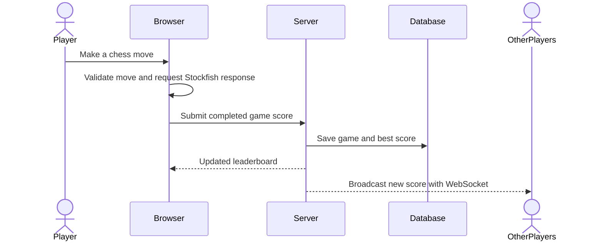

# Stockfish Survival

[My Notes](notes.md)

Stockfish Survival is a competitive chess game where the goal is not to beat Stockfish, but to survive against it for as many moves as possible. Every player faces the same engine difficulty and move time limit so scores are comparable. Completed games are saved and ranked on a global leaderboard.

## 🚀 Specification Deliverable

For this deliverable I did the following. I checked the box `[x]` and added a description for things I completed.

- [x] I completed the prerequisites for this deliverable (Git commit requirement)
- [x] **Proper use of Markdown** - The README uses headings, links, lists, an embedded image, a checklist, a fenced code block, and a Mermaid sequence diagram.
- [x] **A concise and compelling elevator pitch** - The elevator pitch explains the core idea and why competing to survive against Stockfish is interesting.
- [x] **Description of key features** - The key features section describes authentication, gameplay, scoring, saved results, the leaderboard, realtime updates, and third-party data.
- [x] **Description of how you will use each technology** - HTML, CSS, React, the backend service, MongoDB/login, WebSocket, and the Chess.com PubAPI are all explicitly described.
- [x] **One or more rough sketches of your application** - The rough wireframe is embedded below using a Markdown image reference.

### Elevator pitch

Most people are not going to beat Stockfish, but that does not mean playing it cannot be competitive. Stockfish Survival turns losing to one of the strongest chess engines in the world into the game itself. Players compete to survive as many moves as possible under the same conditions, save their best attempts, and watch the leaderboard update as other players finish games. It is simple to understand, difficult to master, and gives every game an obvious score to beat.

### Design


The application will have three main views: authentication/home, the chess game, and the leaderboard. The game view keeps the chessboard as the main focus and shows the current number of moves survived and the move clock. The leaderboard shows the best completed attempts.


```mermaid
sequenceDiagram
    actor Player
    participant Browser
    participant Server
    participant Database
    actor OtherPlayers

    Player->>Browser: Make a chess move
    Browser->>Browser: Validate move and request Stockfish response
    Browser->>Server: Submit completed game score
    Server->>Database: Save game and best score
    Server-->>Browser: Updated leaderboard
    Server-->>OtherPlayers: Broadcast new score with WebSocket
```

### Key features

- Register, log in, and log out
- Play chess against a fixed Stockfish difficulty
- Use a fixed move clock so leaderboard attempts are comparable
- Track the number of moves survived before checkmate, resignation, or timeout
- Save completed games and personal best scores
- Display a global leaderboard ranked by moves survived
- Push new scores and game activity to connected users in realtime
- Optionally look up public Chess.com player statistics for a supplied Chess.com username

### Technologies

I am going to use the required technologies in the following ways.

- **HTML** - Provides the structure for the login, chess game, leaderboard, navigation, forms, buttons, status information, and application content.
- **CSS** - Styles the chessboard and application, creates a responsive layout for desktop and mobile screens, and provides clear visual feedback for selected squares, legal moves, game status, and leaderboard information.
- **React** - Provides components for authentication, the chessboard, game controls, player status, and leaderboard. React state will update the board, timer, game status, and navigation in response to user actions.
- **Service** - A Node.js/Express backend will provide endpoints for registration, login, logout, submitting completed games, retrieving personal game history, and retrieving leaderboard scores. The application will also call the [Chess.com PubAPI](https://support.chess.com/en/articles/9650547-what-is-the-pubapi-and-how-do-i-use-it) as the required third-party web service to retrieve public chess player statistics for an optional Chess.com username.
- **DB/Login** - MongoDB will store registered users, hashed authentication credentials, completed games, and best scores. Game submission and personal data endpoints will require authentication.
- **WebSocket** - When a player finishes a game or sets a new high score, the backend will broadcast that event to connected browsers so the leaderboard and live activity feed can update without refreshing the page.


## 🚀 AWS deliverable

For this deliverable I did the following.

- [x] **Server deployed and accessible with custom domain name** - <https://startup.beatstockfish.click>

**Startup URL for grading: <https://startup.beatstockfish.click>**

### EC2 server (10%)

- Launched an Ubuntu 24.04 `t3.micro` EC2 instance in `us-east-2` (AMI `ami-00adec9774170bad2`), instance ID `i-022afe63f35cd4af9`.
- Created an ed25519 SSH key pair `beatstockfish-key`. The private key lives locally at `~/.ssh/beatstockfish-key.pem` and is **not** committed.
- Created a security group that allows inbound TCP `22` (SSH), `80` (HTTP), and `443` (HTTPS), plus UDP `443` for HTTP/3, from anywhere.
- Allocated an Elastic IP (`3.151.188.205`) and associated it with the instance so the public address is stable across restarts.
- The instance runs a user-data boot script that installs Caddy from the official apt repository and enables it as a `systemd` service, so the web server comes up automatically.
- Verified reachable at `http://3.151.188.205` (now issues a `308` redirect to HTTPS, which is Caddy's default behavior once a domain is configured).

### Domain name (10%)

- Registered the domain **`beatstockfish.click`** through Porkbun.
- Created a **Route 53 public hosted zone** for `beatstockfish.click` (hosted zone ID `Z10157641EIX9JEG4AC8O`).
- Changed the authoritative nameservers at Porkbun to the four Route 53 nameservers, so all DNS for the domain is now served by Route 53:
  - `ns-660.awsdns-18.net`, `ns-261.awsdns-32.com`, `ns-1161.awsdns-17.org`, `ns-2037.awsdns-62.co.uk`
- Added A records in the Route 53 hosted zone, all pointing at the Elastic IP `3.151.188.205`:
  - `beatstockfish.click`
  - `startup.beatstockfish.click`
  - `*.beatstockfish.click` (wildcard, for future subdomains)
- Note: Route 53's *domain registration* service is blocked on the new AWS account experience unless you irreversibly "activate advanced features", so the domain itself was registered at Porkbun and then delegated to Route 53 for DNS hosting.

### HTTPS via Caddy (80%)

- Replaced the default `:80` site block in `/etc/caddy/Caddyfile` on the server with a domain-based configuration:

  ```
  {
      email msch2022@byu.edu
  }

  beatstockfish.click, startup.beatstockfish.click {
      root * /usr/share/caddy
      file_server
  }
  ```

- Ran `sudo caddy validate` then `sudo systemctl reload caddy`. Caddy automatically obtained Let's Encrypt certificates for both hostnames over the ACME challenge and now redirects all HTTP traffic to HTTPS.
- The original default file is kept on the server as `/etc/caddy/Caddyfile.default.bak`.
- Replaced the default Caddy welcome page at `/usr/share/caddy/index.html` with a simple landing page for the startup that includes the required text "Web Programming 260" (original kept as `/usr/share/caddy/index.html.caddy-default.bak`).

### Verification

- <https://startup.beatstockfish.click> serves the startup landing page over HTTPS with a valid Let's Encrypt certificate (issuer: Let's Encrypt, subject CN `startup.beatstockfish.click`), and the page contains the text "Web Programming 260".
- <https://beatstockfish.click> also serves the page over HTTPS.
- `http://startup.beatstockfish.click` returns `308 Permanent Redirect` to the `https://` URL.
## 🚀 HTML deliverable

For this deliverable I did the following.

- [x] **HTML pages** - Four pages, one per main view: `index.html` (home/login), `play.html` (the game), `leaderboard.html` (top scores), and `about.html` (game description and the Chess.com lookup).
- [x] **Proper HTML element usage** - Every page uses `header`, `nav`, `menu`, `main`, and `footer` for structure, plus `form`, `label`, `input`, `button`, and `table` for content.
- [x] **Links** - The nav menu on every page links to all four pages, and the home page and every footer link out to this GitHub repo.
- [x] **Text** - The home page has the elevator pitch, and the about page describes the game and how a match ends.
- [x] **3rd party API placeholder** - The about page has a form to look up a Chess.com username and a placeholder result area for the stats that will come back from the Chess.com PubAPI.
- [x] **Images** - The about page embeds the rough wireframe (`stockfish-survival-wireframe.png`).
- [x] **Login placeholder** - The home page has a login/create-account form and a "Playing as" area that will show the logged-in player's name.
- [x] **DB/Login placeholder** - The leaderboard page shows a table of top survivors that will eventually be populated from MongoDB.
- [x] **WebSocket placeholder** - The play page has a "Live activity" list that will show realtime notifications about other players' games.

## 🚀 CSS deliverable

For this deliverable I did the following. Checked items map directly to the grading rubric's six CSS criteria.

- [x] **Visually appealing colors and layout; no overflowing elements** - A consistent dark theme (`bg-dark`/`text-light`) runs across all four pages, with a coordinated gold accent (`rgb(221, 148, 40)`) reused for the leaderboard's top row and the Chess.com rating, and a light-blue accent (`rgb(118, 190, 210)`) for the player name. Overflow is handled deliberately in several places: the chessboard sizes itself with `min(90vw, 500px)` and its glyphs with `min(8vw, 44px)` so it always fits and stays square; the leaderboard table uses `table-layout: fixed` plus per-cell `max-width`/`text-overflow: ellipsis` so long names (tested with `도윤 이`) truncate instead of breaking the layout; and the nav bar (`main.css`) is forced to `flex-wrap: nowrap` with `overflow-x: auto` as a contained horizontal-scroll fallback, so it can never wrap into a second line that covers page content on very narrow screens.
- [x] **Use of a CSS framework (Bootstrap 5.3.3)** - Loaded via CDN in every page's `<head>` (loaded *before* the page's own stylesheets so local overrides reliably win). Used for the navbar, buttons (`btn btn-primary`, `btn btn-outline-danger`), form controls (`input-group`, `form-control`), the leaderboard table (`table table-warning table-striped-columns`, `table-dark` header), and layout/utility classes (`container-fluid`, `bg-dark`, `text-light`, etc.) throughout.
- [x] **All visual elements styled using CSS** - Every element type has deliberate styling: header/nav/footer, buttons and form inputs, headings, body text, the wireframe image, the leaderboard table, the fully custom CSS-drawn chessboard (no `bgcolor` attributes), the live-activity notification list, and form labels.
- [x] **Responsive to window resizing (flexbox)** - `main.css` uses flex to size header/main/footer and to keep the nav row from collapsing; `play.css` uses flex for the game-status row that switches to a column in `@media (orientation: portrait)`; `@media (max-height: 600px)` hides the header/footer so the board gets full-screen space on short viewports; and a narrow-width media query (`max-width: 480px`) shrinks the nav's font size/padding so it fits without scrolling on virtually all phone widths.
- [x] **Use of an imported font** - Google Fonts' `Cinzel` (a serif display face, weights 600/700) is imported in `main.css` and applied to the site's `<h2>` headings and the `.navbar-brand` wordmark, giving the chess theme a distinct look from Bootstrap's default sans-serif.
- [x] **Different selector types** - Element (`body`, `header`, `td`), class (`.navbar-brand`, `.stat-box`, `.game-status`), ID (`#board`, `#picture`), and pseudo-class (`:nth-child`, `:first-child`) selectors are all used across `main.css`/`about.css`/`leaderboard.css`/`play.css`.

## 🚀 React Phase 1: Routing deliverable

For this deliverable I did the following.

- [x] **Bundled using Vite** - The startup is now a Vite project: `package.json` has the `dev`/`build`/`preview` scripts, the single `index.html` loads `index.jsx`, static assets live in `public/`, and `deployReact.sh` runs `npm run build` and deploys the `dist` bundle to <https://startup.beatstockfish.click>. The Simon tutorial port is the same setup in [`simon/`](simon), deployed to <https://simon.beatstockfish.click>.
- [x] **Components** - Each old HTML page is now a React component in its own folder with its own CSS: `src/login/login.jsx`, `src/play/play.jsx`, `src/leaderboard/leaderboard.jsx`, `src/about/about.jsx`, plus `src/notfound/notfound.jsx`. The header, nav, and footer that every page used to repeat live once in `src/app.jsx`, and buttons use React Bootstrap's `Button`. The Play board is rendered by mapping over the starting position instead of 64 hand-written cells.
- [x] **Router** - `src/app.jsx` wraps the app in `BrowserRouter`, the nav uses `NavLink` (with the active link highlighted), and `Routes` maps `/`, `/play`, `/leaderboard`, and `/about` to their components, with a `*` route for `NotFound`. Caddy falls back to `index.html` so deep links like `/play` work when opened directly.

## 🚀 React Phase 2: Reactivity

For this deliverable I did the following. Everything below is live at <https://startup.beatstockfish.click>, and the Simon React P2 prerequisite is deployed at <https://simon.beatstockfish.click> (code in [`simon/`](simon)).

- [x] **All functionality implemented or mocked out** (multiple React components) - The app is fully playable end to end:
  - **Login** (`src/login/`) - `Login` switches between an `Unauthenticated` form (email + password, Login / Create Account, plus a "play as a guest" link) and an `Authenticated` view (Play / Logout). Logging in takes you to the game, and errors such as an unknown email or a duplicate account appear in a React Bootstrap modal (`MessageDialog`). *Mocked:* `authService.js` keeps registered emails and the current user in localStorage (never the password) until the Login deliverable adds `/api/auth` endpoints.
  - **App / navigation** (`src/app.jsx`) - Holds the logged-in user (state lifted up from Login) and passes it to Play, and your name shows in the nav bar. **Anyone can play, including guests without an account. What logging in unlocks is having your games saved:** only logged-in players' games go on the leaderboard and into the live feed, and a guest's game-over message invites them to log in.
  - **Play** (`src/play/`) - `ChessGame` is a real game of chess against the engine. Click a white piece to see its legal moves (dots, or rings for captures), click a destination to move, and the engine answers as black. The last move and a king in check are highlighted, and pawns promote to a queen. *Moves survived* counts your moves, and the 30-second *move clock* ticks down on your turn and ends the game at 0:00. **Resign** and **New Game** work, and checkmate, resignation, timeout, or a draw ends the game with a message and saves the score (for logged-in players). Rules and move legality come from `chess.js`. `ChessBoard` is a presentational component that renders the position and the highlights. **The opponent is real Stockfish 19:** the lite WebAssembly build from [Stockfish.js](https://github.com/nmrugg/stockfish.js) (`public/stockfish/`, GPLv3) runs in a Web Worker in the player's browser, so it costs the server nothing. `engine.js` talks to it over the UCI protocol with a fixed 60,000-node search per move, so it plays at the same strength on every device and scores stay comparable. If the engine can't load, a small built-in minimax (`fallbackEngine.js`) plays instead.
  - **Live activity** (`src/play/liveActivity.jsx`) - A feed of other players starting and finishing games, plus your own games in bold. *Mocked:* `gameNotifier.js` fakes the WebSocket feed with `setInterval` (running only while someone is listening), and your own game start/end events go through the same notifier.
  - **Leaderboard** (`src/leaderboard/`) - Shows the top ten completed games by moves survived, marks your own games, and shows a "be the first" message when it's empty. *Mocked:* `scores.js` stores scores in localStorage until the DB deliverable.
  - **About** (`src/about/`) - The Chess.com lookup works: type a username to see blitz rating, wins, losses, and draws, with a loading state and validation errors. *Mocked:* `chesscomService.js` returns hard-coded data shaped like the PubAPI `/pub/player/{username}/stats` response, after a simulated network delay.
- [x] **Hooks** - `useState` holds every reactive value: the auth state and user in `App`, the form fields and error in `Unauthenticated`, the position, moves survived, clock, selection, last move, and result in `ChessGame`, the feed in `LiveActivity`, the scores in `Leaderboard`, and the lookup in `About`. `useEffect` handles lifecycle and timing:
  - `ChessGame` starts loading Stockfish when the board first appears.
  - `ChessGame` requests the engine's reply when it's black's turn, and ignores a stale reply if the game is reset or the page is left.
  - `ChessGame` ticks the move clock with an interval that is cleared on every move and on unmount, and a third effect ends the game when the clock reaches zero.
  - `LiveActivity` subscribes to and unsubscribes from the notifier.
  - `Leaderboard` loads the saved scores when it opens.
  - `About` loads a default player when it opens.

  `useRef` keeps the `chess.js` game instance across renders, and `useNavigate` moves you to `/play` after you log in.

## 🚀 Service deliverable

For this deliverable I did the following. Live at <https://startup.beatstockfish.click>, and the Simon Service prerequisite is deployed at <https://simon.beatstockfish.click> (code in [`simon/`](simon), including its own `simon/service` backend).

- [x] **Node.js/Express HTTP service** - [`service/index.js`](service/index.js) is an Express 5 app in its own npm project (`service/package.json`: `express`, `cookie-parser`, `bcryptjs`, `uuid`). It listens on port 4000 (or the port passed on the command line) and runs on the server as the `startup` PM2 app behind Caddy. `vite.config.js` proxies `/api` to it while debugging with `npm run dev`.
- [x] **Static middleware for frontend** - `app.use(express.static('public'))` serves the Vite build, which `deployService.sh` copies into `public/`. That includes the Stockfish WebAssembly files, served with the correct `application/wasm` type. Any other path without a file extension (`/play`, `/leaderboard`, ...) gets `index.html` so the React router can handle it, and a missing file like `/logo.png` gets a real 404.
- [x] **Calls to third party endpoints** - The About page's Chess.com lookup ([`src/about/chesscomService.js`](src/about/chesscomService.js)) calls the real [Chess.com PubAPI](https://www.chess.com/news/view/published-data-api) from the browser with `fetch`. It requests `/pub/player/{username}` (avatar, profile link) and `/pub/player/{username}/stats` (rating and win/loss/draw record) in parallel, and handles unknown players (404) and network errors.
- [x] **Backend service endpoints** - `POST /api/auth/create`, `POST /api/auth/login`, `DELETE /api/auth/logout`, `GET /api/user/me`, `GET /api/scores` (the public leaderboard, top ten by moves survived), and `POST /api/score` (save a finished game). The server sets a saved game's player name (the part of the email before the @, since the leaderboard is public) and its date, and it validates the move count and result, so nobody can post a score as someone else or post junk. Bad JSON and missing fields get 400s with a message instead of crashing.
- [x] **Frontend calls service endpoints** - Login and Create Account ([`src/login/authService.js`](src/login/authService.js)) call the auth endpoints and show the server's error messages, such as a wrong password or an existing account, in the dialog. Logout calls `DELETE /api/auth/logout`. On load, `App` checks the remembered login against `GET /api/user/me` and logs out a stale session. A logged-in player's finished games are `POST`ed to `/api/score` ([`src/leaderboard/scores.js`](src/leaderboard/scores.js)), and the leaderboard `fetch`es `GET /api/scores` in a `useEffect`, with loading and error states. localStorage no longer stores accounts or scores.
- [x] **Supports registration, login, logout, and restricted endpoint** - Registering and logging in set an `httpOnly`, `secure`, `sameSite=strict` cookie holding a random UUID token. Logout deletes the token on the server and clears the cookie. A `verifyAuth` middleware guards `GET /api/user/me` and `POST /api/score`, returning 401 without a valid token. Guests can still play, but only logged-in players' games are saved.
- [x] **Uses BCrypt to hash passwords** - `bcrypt.hash(password, 10)` on registration and `bcrypt.compare` on login; plain-text passwords are never stored. Users and scores live in memory until the DB deliverable moves them to MongoDB.

**Also in this deliverable: mobile support.** On phones the nav collapses into a tappable hamburger menu, and the header is sticky so it never covers content. Nothing scrolls sideways at 320-430px. The Play view sizes the board from one `--board-size` variable, so the whole board fits on screen together with the clock and buttons in portrait, and sits beside them in phone landscape. Squares and buttons use `touch-action: manipulation` for instant taps. The leaderboard and the Chess.com lookup are compacted for narrow screens.

## 🚀 DB/Login deliverable

For this deliverable I did the following.

- [ ] **User registration** - I did not complete this part of the deliverable.
- [ ] **User login and logout** - I did not complete this part of the deliverable.
- [ ] **Stores data in MongoDB** - I did not complete this part of the deliverable.
- [ ] **Stores credentials in MongoDB** - I did not complete this part of the deliverable.
- [ ] **Restricts functionality based on authentication** - I did not complete this part of the deliverable.

## 🚀 WebSocket deliverable

For this deliverable I did the following.

- [ ] **Backend listens for WebSocket connection** - I did not complete this part of the deliverable.
- [ ] **Frontend makes WebSocket connection** - I did not complete this part of the deliverable.
- [ ] **Data sent over WebSocket connection** - I did not complete this part of the deliverable.
- [ ] **WebSocket data displayed** - I did not complete this part of the deliverable.
- [ ] **Application is fully functional** - I did not complete this part of the deliverable.
